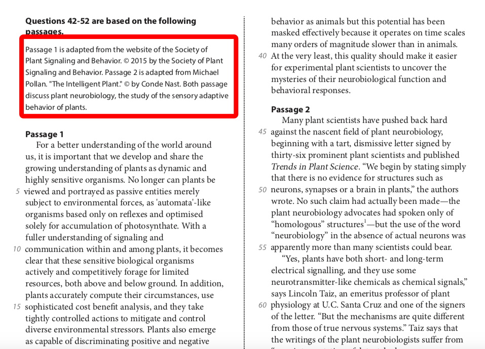
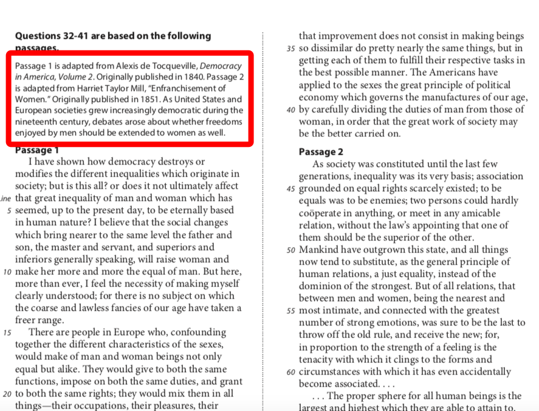

<notice>教程读者请不要直接阅读本文件，因为诸多功能在此无法正常使用，请移步至[程谱 coderecipe.cn](https://coderecipe.cn/learn/10)学习完整教程。如果您喜欢我们的教程，请在右上角给我们一个“Star”，谢谢您的支持！</notice>
Checkpoint 1 （简述）
======

双篇的文章题材选择
-----
这两篇文章一定是针对一个共同的话题或内容，而观点或角度不同，可能构成对立，互补，部分对立等关系。要想将双篇题目做好，需要清楚的知道每一篇文章的主旨，和两篇文章的主旨有何不同。

在题材上来看，根据以往真题总结，有80%的双篇文章以历史文章为题材，剩下的20%以科学类文章为题材。可从文章前面的背景介绍轻易判断出双篇文章的题材类型。

科学类双篇：

历史类双篇：

虽然题材不同，但是双篇文章考察的题目类型和解题的方法论确实不变的。
